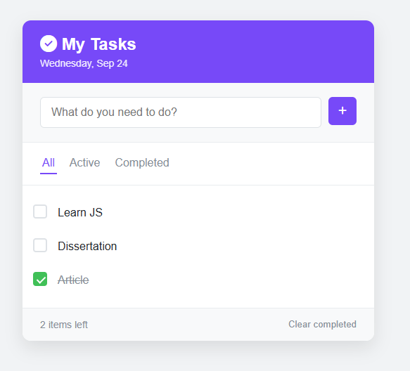

# 📝 My Tasks - Todo App  

A simple and elegant **Todo List application** built with **HTML, CSS, and JavaScript**.  
Manage your daily tasks with add, delete, complete, filter, and persistence features.  

  

---

##  Features  
- Add new tasks  
- Mark tasks as completed / uncompleted  
- Delete tasks  
- Clear all completed tasks at once  
- Filter tasks (All / Active / Completed)  
- Task persistence with **localStorage**  
- Displays current date  
- Shows number of active tasks left  
- Clean and responsive UI  

---

## 🛠️ Tech Stack  
- **HTML5**  
- **CSS3 (Flexbox & modern design)**  
- **Vanilla JavaScript (ES6+)**  
- **LocalStorage API**  

---

## 📂 Project Setup  
Clone the repository and open the project in your browser.
